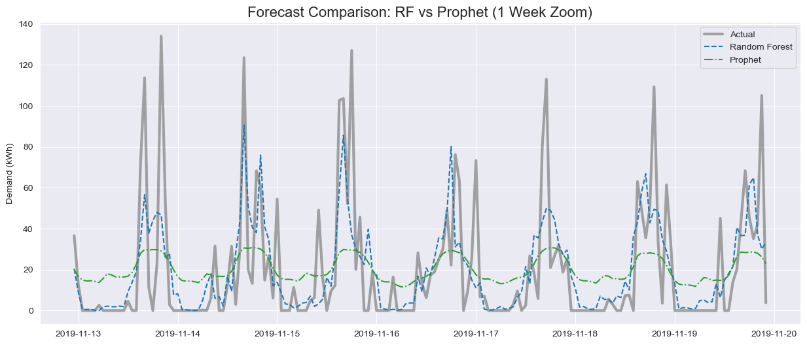
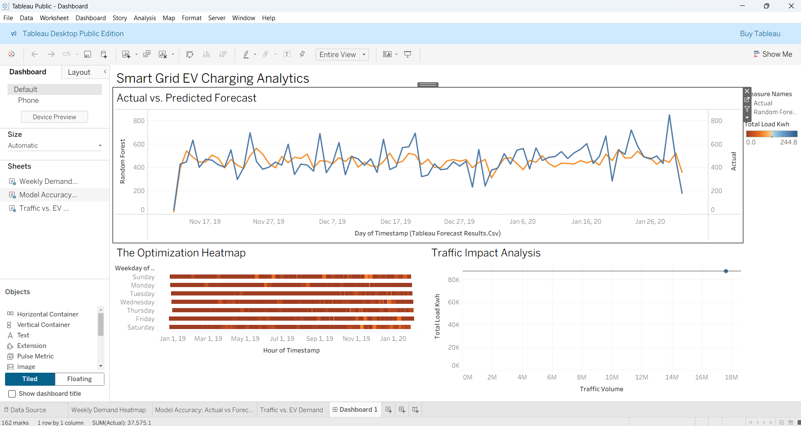

# ⚡ Electric Vehicle (EV) Charging Demand Forecasting


## 📄 Abstract
The rapid adoption of Electric Vehicles (EVs) challenges power grids with unpredictable, high-variance charging loads. This project develops a machine learning pipeline to forecast **hourly EV charging demand (kWh)** by integrating three disparate data sources: historical charging sessions, local traffic density, and weather conditions.

A **"Champion-Challenger"** strategy was employed, comparing a baseline **Facebook Prophet** model against a **Random Forest Regressor**. The Random Forest model demonstrated superior performance in capturing short-term demand spikes, enabling grid operators to optimize load balancing and prevent outages.

## 📊 Project Overview
* **Objective:** Forecast hourly energy consumption for EV charging stations 24-48 hours in advance.
* **Domain:** Energy Analytics, Time Series Forecasting, Smart Grid.
* **Key Techniques:** Feature Engineering (Lag Features, Cyclical Encoding), Ensemble Learning (Random Forest), Trend Analysis (Prophet).

## 📂 Dataset
The project merges three distinct datasets (European format):
1.  **EV Charging Reports:** Transactional data of individual charging sessions.
2.  **Local Traffic Distribution:** Hourly traffic volume from local sensors.
3.  **Weather Data:** Daily temperature, precipitation, and wind speed.

*Dataset Source:* [Kaggle - Residential EV Charging Data](https://www.kaggle.com/datasets/anshtanwar/residential-ev-chargingfrom-apartment-buildings)

## 🛠️ Tech Stack
* **Language:** Python
* **Data Manipulation:** Pandas, NumPy
* **Modeling:** Scikit-Learn (Random Forest), Facebook Prophet
* **Visualization:** Matplotlib, Seaborn, Tableau

## 🚀 Workflow Pipeline
1.  **Data Engineering:**
    * Parsed non-standard timestamps and corrected delimiter issues.
    * Aggregated transactional data into **Hourly Total Load**.
    * Merged external regressors (Traffic & Weather).
2.  **Feature Engineering:**
    * **Temporal:** Cyclical encoding (Sin/Cos) for Hour and Month.
    * **Lags:** Generated 1h, 24h, and 168h (1 week) lag features to capture autocorrelation.
3.  **Modeling:**
    * **Chronological Split:** Train (First 80%) / Test (Last 20%) to prevent data leakage.
    * **Scaling:** Standard Scaler applied to numeric features.
    * **Comparison:** Evaluated RMSE of Prophet vs. Random Forest.

## 📈 Results & Insights
* **Random Forest** outperformed Prophet by significantly reducing RMSE.
* **Key Insight:** The "spiky" nature of EV demand is best predicted by **Recent History (Lag 1h)** and **Traffic Volume**, rather than smooth seasonal trends.
* **Visualization:** The Tableau dashboard highlights peak demand hours (typically late afternoon/evening), providing actionable insights for dynamic pricing.

### Visuals

**1. Model Comparison (Actual vs. Predicted)**


**2. Tableau Dashboard**


## 💻 How to Run
1.  **Clone the repository:**
    ```bash
    git clone [https://github.com/Sriram-ai-prog/Capstone_Project](https://github.com/Sriram-ai-prog/Capstone_Project)
    ```
2.  **Install dependencies:**
    ```bash
    pip install pandas numpy scikit-learn matplotlib seaborn prophet
    ```
3.  **Run the Notebooks:**
    * Run `01_Data_Preprocessing.ipynb` to generate the clean dataset.
    * Run `02_Modeling_and_Evaluation.ipynb` to train models and view results.

## 📜 Conclusion
This project demonstrates that while traditional time-series models (like Prophet) capture general trends, **Machine Learning approaches (Random Forest) with robust feature engineering** are necessary for high-volatility utility forecasting.

---
*Created by Tadishetty Sriram*